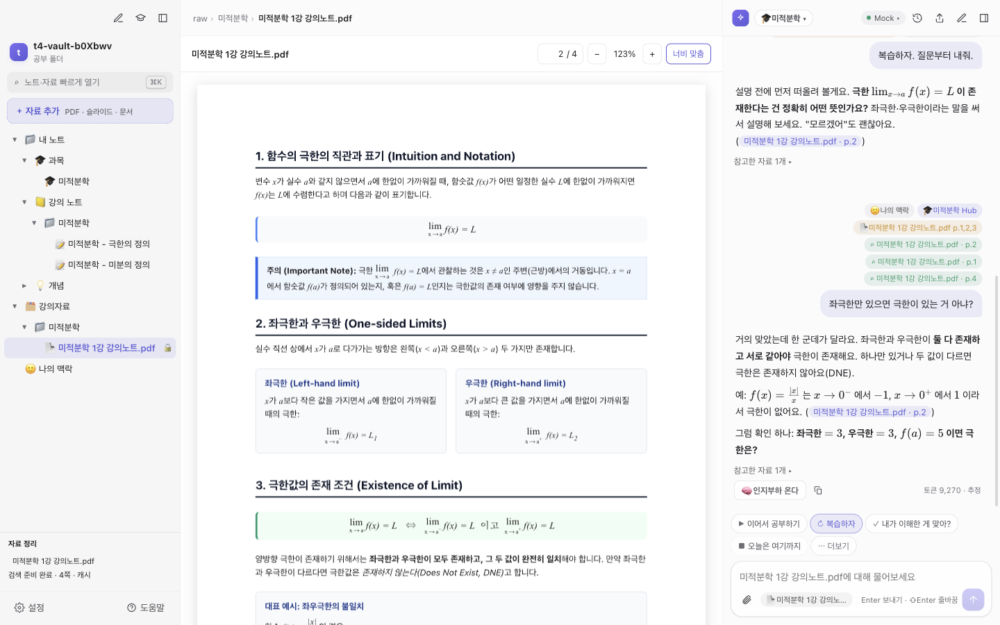
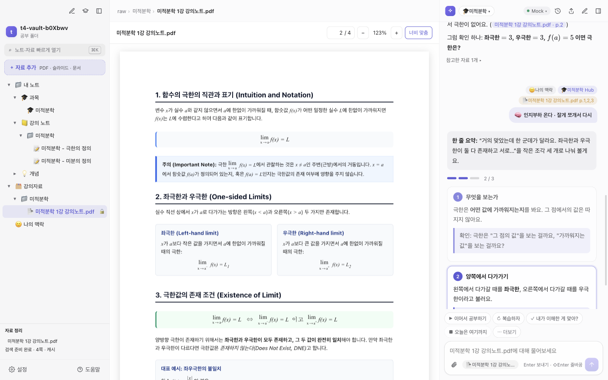

# SSAM 다운로드

**SSAM** (Special Study Assist Model) — 강의자료를 넣고 물어보면, AI 튜터가 내 자료를 근거로 페이지 출처를 달아 설명하고, 배운 것과 헷갈린 것을 **내가 직접 보고 고칠 수 있는 노트**로 남겨 주는 공부 앱이에요.

**[⬇️ 최신 버전 받기](https://github.com/DH-WEST-coder/team4-study-releases/releases/latest)** · **[📖 사용설명서 전체](사용설명서.md)**



## 이런 걸 해요

| | |
|---|---|
| **세 칸으로 공부** | 왼쪽 과목·자료 목록, 가운데 PDF·노트, 오른쪽 AI 튜터. ⌘\ · ⌘L로 패널을 접어 자료를 크게 볼 수 있어요. |
| **자료는 넣기만 하면 정리** | PDF·슬라이드를 끌어다 놓으면 검색할 수 있게 읽고 스터디 노트까지 만들어 둬요. 원본은 읽기 전용이에요. |
| **쓰던 폴더 그대로** | 이미 과목별로 정리한 공부 폴더를 열면, 폴더마다 **과목으로 연결**(복사·이동 없음) / **과목으로 옮기기** / **검색에만** 중에서 골라요. |
| **근거 있는 답** | 튜터는 내 PDF·노트를 찾아 읽고 `강의노트.pdf · p.3` 같은 출처 링크를 달아요. 누르면 그 페이지가 열려요. |
| **🧠 인지부하 온다** | 설명이 버거우면 답 아래 버튼을 누르세요. 한 줄 요약 → 작은 단계로 쪼개 하나씩, 단계마다 확인 질문. 막힌 단계만 더 쪼갤 수도 있어요. |
| **기록 카드** | "오늘은 여기까지"를 누르면 맞힌 것·틀린 것과 다음 시작점을 보여 주고, 내가 저장해야 노트에 남아요. 다음엔 그 기록에서 이어가요. |



## 설치

**윈도우 (64비트)** — `SSAM-Setup-x.y.z.exe`
1. exe를 받아 실행해요.
2. 파란 "Windows의 PC 보호" 창이 뜨면 **추가 정보 → 실행**을 눌러요. (정식 서명을 하지 않은 앱이라 뜨는 경고예요.)
3. 이후 업데이트는 앱이 알아서 받아 두고, 재시작하면 적용돼요.

**맥 (Apple Silicon)** — `SSAM-mac-arm64-x.y.z.zip`
1. zip을 받아요(보통 **다운로드** 폴더에 저장돼요). 새로 받은 버전의 zip이 맞는지 파일 이름의 숫자를 확인해요. 예전 zip만 있으면 예전 버전이 설치돼요.
2. **터미널**에 아래 한 줄을 붙여넣어요. 가장 최근에 받은 zip을 **다운로드** 폴더의 `SSAM-new` 폴더에 풀고 Finder로 열어 줘요. 처음 설치할 때도, 업데이트할 때도 같은 명령이에요. (앞의 `rm -rf`는 지난번에 푼 `SSAM-new` 폴더를 먼저 지워서 옛 파일과 섞이지 않게 해요.)
   ```
   rm -rf ~/Downloads/SSAM-new && ditto -x -k --noqtn "$(ls -t ~/Downloads/SSAM-mac-arm64-*.zip | head -1)" ~/Downloads/SSAM-new && xattr -cr ~/Downloads/SSAM-new/SSAM.app && open ~/Downloads/SSAM-new
   ```
3. 열린 Finder 창의 **SSAM.app**을 **응용 프로그램** 폴더로 끌어다 놓아요. 이미 있으면 **대치**를 눌러요.

"손상되었기 때문에 열 수 없습니다"는 앱이 깨진 게 아니라 서명 없는 앱의 다운로드 표시 때문이에요. 위 명령의 `xattr -cr`이 지워 줘요. 터미널로 응용 프로그램 폴더의 SSAM을 바로 덮어쓰면 macOS가 "Operation not permitted"로 막을 수 있어서, Finder로 끌어다 놓는 방법을 써요.

0.1.10 버전부터는 앱 안의 업데이트가 기본이에요. macOS가 막으면 앱이 Finder를 열어 새 SSAM을 끌어다 놓을 수 있게 준비해 줘요.

## 처음 열면

1. **기능 둘러보기**(여섯 장)가 먼저 나와요. 마지막 장이 간단한 사용법이에요. 건너뛰어도 되고, 나중에 도움말에서 다시 볼 수 있어요.
2. 시작 방법을 골라요: **예시 과목으로 둘러보기**(처음이면 추천) · **처음 시작할게** · **기존 공부 폴더 열기**.
3. AI를 연결해요: ChatGPT 계정 로그인, 또는 이미 로그인된 Codex CLI · Claude Code. 연결 전에는 시연용 Mock 튜터로 동작해요.

## 간단한 사용법

공부 한 번은 이 네 단계면 돼요. 앱 안의 **처음 해 볼 것** 목록에도 같은 순서가 있어요.

1. **강의자료 열기** — 왼쪽에서 PDF를 누르거나, 파일을 끌어다 놓아 추가해요.
2. **튜터에게 물어보기** — 궁금한 걸 그냥 써요. 답의 출처 링크를 누르면 그 페이지가 열려요. PDF에서 문장을 드래그하면 "튜터에게 묻기"도 돼요.
3. **어려우면 🧠 인지부하 온다** — 답 아래 버튼을 누르면 작은 단계로 쪼개서 하나씩 다시 설명해요.
4. **마칠 때 "오늘은 여기까지"** — 오늘 한 것과 다음 시작점이 기록 카드로 떠요. 저장하면 다음에 열 때 "이어서 공부하기"로 거기서 시작해요.

공부 자료와 기록은 내 컴퓨터의 공부 폴더에 평범한 `.md` 파일로 남아요. 앱을 지워도 그대로예요.

---
이 저장소는 설치 파일과 설명서만 올리는 곳이에요. 문제나 불편한 점은 조원 단톡으로 알려 주세요.
