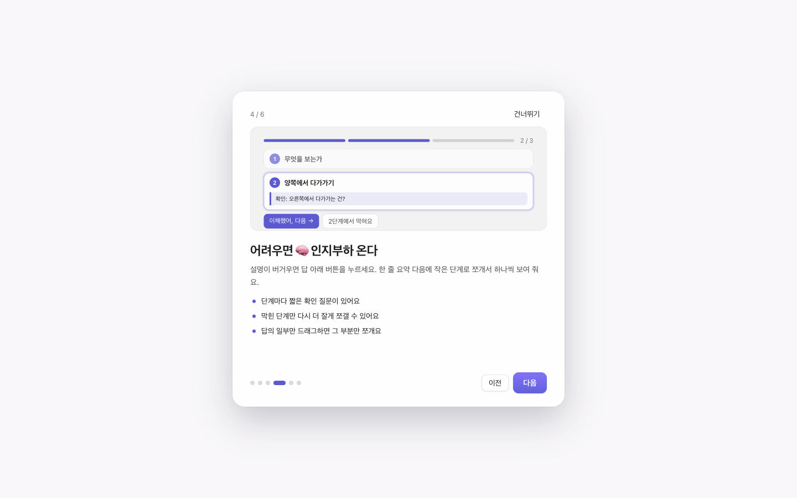
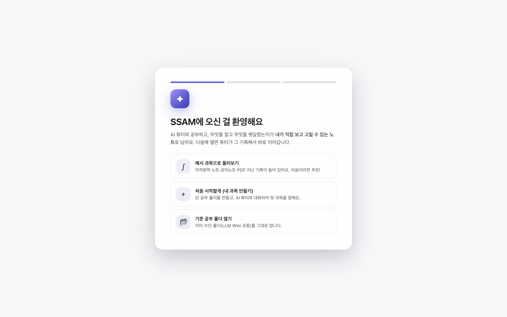
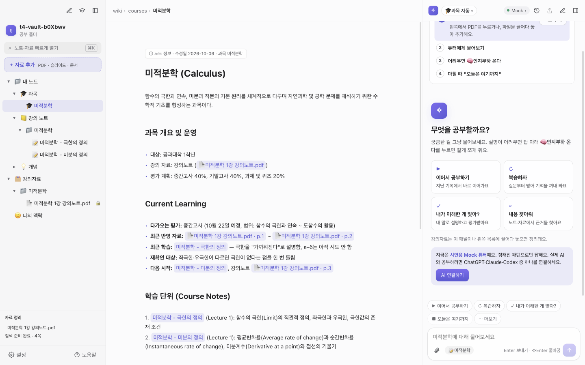
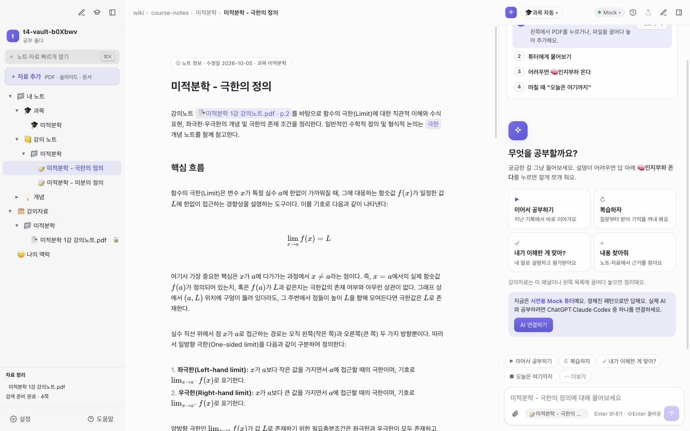
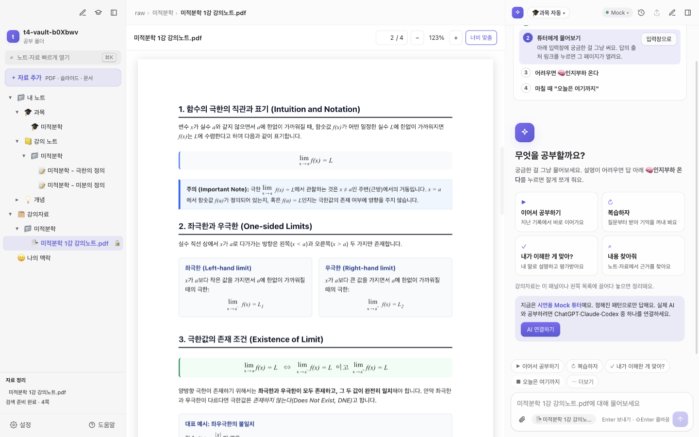
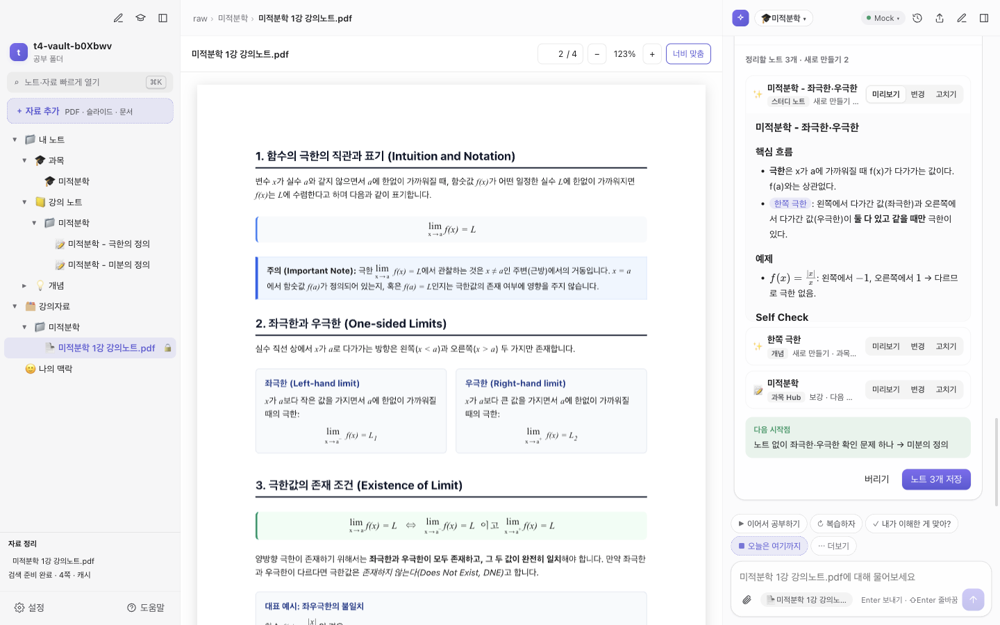
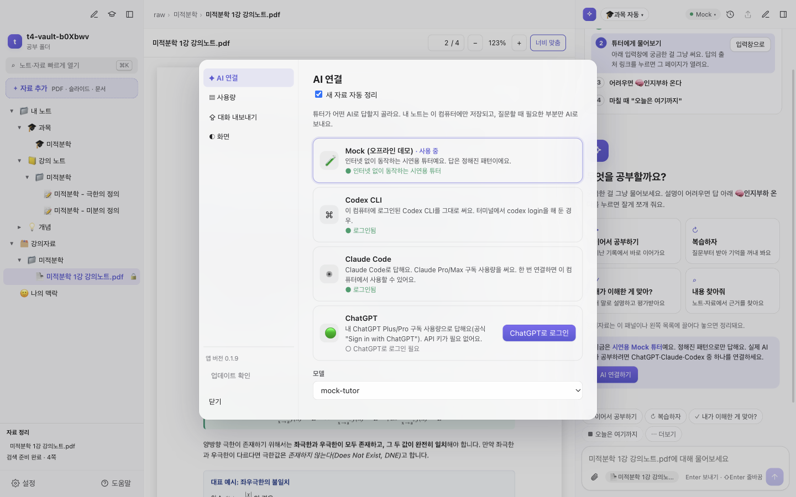
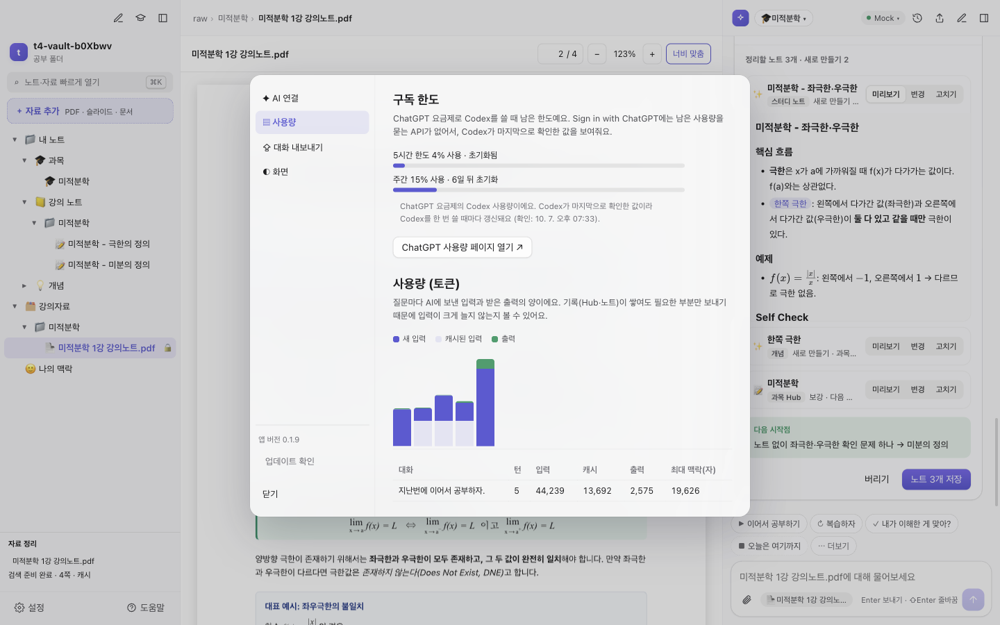
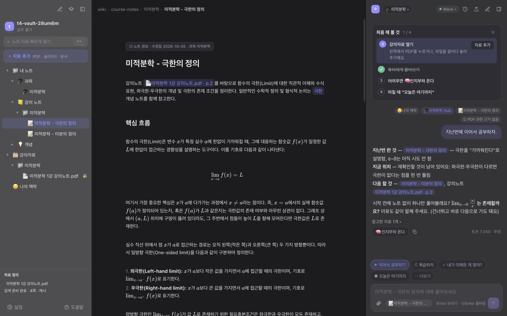

# SSAM 사용설명서

> SSAM = Special Study Assist Model. 공부 자료를 넣고 물어보면 되는 AI 학습 도우미예요.

대학생을 위한 AI 튜터 기반 학습 앱, SSAM에 오신 것을 환영해요! 이 설명서에서는 처음 시작하는 분도 쉽게 따라 할 수 있도록 설치부터 AI 튜터 활용법, 노트 작성, 문제 해결 방법까지 차근차근 알려드릴게요.

---

## 1. SSAM는 뭐예요?

SSAM는 내 공부 기록을 바탕으로 AI 튜터와 함께 공부하는 앱이에요. 일반 챗봇의 "공부 모드"와는 크게 세 가지가 달라요.

1. **기록이 내 컴퓨터에 남아요**: 공부한 모든 기록이 내 컴퓨터 안에 평범한 마크다운(`.md`) 파일로 저장되어, 내가 직접 언제든 열어보고 고칠 수 있어요.
2. **지난 공부에서 자연스럽게 이어가요**: AI 튜터가 과목 Hub 노트의 "Current Learning" 절을 읽고, 지난 시간에 어디까지 공부했는지 확인한 뒤 바로 이어서 시작해요.
3. **내 승인이 있어야 저장돼요**: 튜터와의 대화 내용은 멋대로 저장되지 않고, 대화 끝에 뜨는 확인 카드에서 내가 승인한 내용만 파일에 반영돼요.

---

## 2. 설치와 첫 실행

**윈도우 (64비트)**
1. 릴리스 페이지에서 `SSAM-Setup-버전.exe`를 받아 실행해요.
2. 파란 "Windows의 PC 보호" 창이 뜨면 **추가 정보 → 실행**을 눌러요(정식 서명을 하지 않은 앱이라 뜨는 경고예요).
3. 다음부터는 앱이 새 버전을 알아서 받아 두고, 설정 옆 ⬇ 버튼이나 재시작으로 적용돼요.

**맥 (Apple Silicon)**
1. 릴리스 페이지에서 `SSAM-mac-arm64-버전.zip`을 내려받아요. 브라우저는 보통 **다운로드** 폴더에 저장해요.
2. 받은 zip의 파일 이름 숫자가 새 버전인지 확인해요. 다운로드 폴더에 예전 zip만 있으면 예전 버전이 설치돼요.
3. **터미널**을 열고 아래 한 줄을 붙여넣어 실행해요. 가장 최근에 받은 SSAM을 **다운로드** 폴더의 `SSAM-new` 폴더에 풀고 Finder로 열어 줘요. 앞의 `rm -rf`는 지난번에 푼 `SSAM-new` 폴더를 먼저 지워서 옛 파일과 섞이지 않게 해요.

   ```
   rm -rf ~/Downloads/SSAM-new && ditto -x -k --noqtn "$(ls -t ~/Downloads/SSAM-mac-arm64-*.zip | head -1)" ~/Downloads/SSAM-new && xattr -cr ~/Downloads/SSAM-new/SSAM.app && open ~/Downloads/SSAM-new
   ```

4. 열린 Finder 창의 **SSAM.app**을 **응용 프로그램** 폴더로 끌어다 놓아요. 이미 있으면 **대치**를 눌러요. 처음 설치할 때도, 새 버전으로 업데이트할 때도 같은 방법이에요(공부 폴더·설정은 그대로예요).

   서명 없는 앱을 브라우저로 받으면 macOS가 "손상되었기 때문에 열 수 없습니다"라고 막을 수 있어요. 앱이 깨진 게 아니라 다운로드 표시 때문이고, 위 명령의 `xattr -cr`이 그 표시를 지워 줘요. 터미널로 응용 프로그램 폴더의 SSAM을 바로 덮어쓰면 macOS가 "Operation not permitted"로 막을 수 있어서 Finder로 끌어다 놓아요.

0.1.10 버전부터는 앱 안에서 바로 업데이트하는 게 기본이에요. 새 버전 알림의 **업데이트**를 누르면 받아서 확인하고, **재시작해서 업데이트**를 누르면 앱이 새 버전으로 바뀌어 다시 열려요. 앱이 있는 폴더에 쓸 권한이 없으면 맥 관리자 암호를 물어봐요. macOS가 교체를 막으면 앱이 Finder를 열고 새 SSAM을 **다운로드 > SSAM-update**에 준비해 주니, 그걸 응용 프로그램으로 끌어다 놓고 **대치**를 누르세요. 그것도 안 되면 릴리스 페이지가 열려요. 응용 프로그램 폴더로 옮겨 둔 앱에서 쓰세요.
**첫 실행**

앱을 처음 열면 **기능 둘러보기**(여섯 장)가 먼저 나와요. 화면 구성, 자료 넣기, 튜터, 🧠 인지부하 온다, 기록 카드를 한 장씩 보여 주고, 마지막 장에서 공부 한 번의 순서(자료 열기 → 물어보기 → 어려우면 🧠 → 마칠 때 기록)를 알려 줘요. 같은 순서가 튜터 패널 위 **처음 해 볼 것** 목록으로 남고, 해 보면 저절로 체크돼요(✕로 닫을 수 있어요). **건너뛰기**로 넘길 수 있고, 나중에 이 설명서 화면 오른쪽 위 **기능 둘러보기**로 다시 볼 수 있어요. 둘러보기가 끝나면 환영 화면이 나타나요.





첫 화면에는 세 가지 시작 방법이 준비되어 있어요.
- **예시 과목으로 둘러보기**: 미적분학 노트, 강의노트 PDF, 지난 공부 기록이 미리 들어 있어요. 앱을 처음 써보신다면 이 선택지를 가장 추천해요.
- **처음 시작할게 (내 과목 만들기)**: 앱이 공부 폴더를 만들어 준 뒤, AI 튜터가 질문을 하나씩 해요(학과·학년 → 과목 → 교재 → 지금 위치/시험). 답하다 보면 첫 과목 Hub가 만들어지고, 마지막에 뜨는 확인 카드에서 **저장**하면 끝이에요. 과목이 하나도 없을 때는 다른 버튼이 잠기고 "먼저 첫 과목을 함께 정해요" 안내가 떠요. 튜터와 대화하기보다 직접 입력하고 싶다면 🎓 버튼으로 과목 정보를 직접 적을 수도 있어요.
- **기존 공부 폴더 열기**: 이미 사용 중이던 공부 폴더나 LLM Wiki 폴더가 있다면 그대로 선택해서 열 수 있어요.
  - 과목별 폴더(예: `반도체 소재/`, `통계학/`)가 맨 위에 있는 폴더라면, 왼쪽에 **기존 폴더 N개를 찾았어요** 카드가 떠요. **정하기**를 누르고 폴더마다 쓰는 방법을 골라요.
    - **과목으로 연결** (기본): 파일을 **복사하거나 옮기지 않고** 과목 Hub를 만들어요. `raw/과목`은 원래 폴더를 가리키는 연결(맥은 심볼릭 링크, 윈도우는 정션)이라, 원래 폴더에 새 파일을 넣으면 앱에도 바로 보여요. 같은 파일이 두 번 나오지 않게 목록에는 강의자료 쪽에만 🔗 표시로 보여요. 연결된 폴더 안의 파일은 앱에서 지우거나 옮기지 않으니, 정리는 Finder·탐색기에서 원래 폴더에 하세요. 우클릭 **연결 해제**는 연결만 지우고 원래 폴더는 남겨요.
    - **과목으로 옮기기**: 폴더를 실제로 강의자료(`raw/과목`)로 옮기고 과목 Hub를 만들어요. 노트 속 링크는 새 위치로 같이 고쳐요. 옮긴 파일은 읽기 전용 자료가 돼요.
    - **검색에만**: 과목으로 만들지 않고 그대로 둬요. 튜터가 과목을 정하지 않고 찾을 때는 이 폴더의 PDF·노트도 검색해요. 다시 묻지 않아요.
  - **이미 있는 과목에 연결**: 연결·옮기기를 고르면 줄마다 **과목** 목록이 나와요. 기본은 `새 과목`이지만, 이미 있는 과목을 고르면 그 과목의 강의자료로 들어가요(새 Hub를 또 만들지 않아요). `반도체 소재`와 `반도체소재`처럼 띄어쓰기·대소문자만 다른 이름은 앱이 같은 과목으로 보고 미리 골라 둬요. 그 과목에 이미 자료가 있으면 `raw/과목/폴더이름` 아래에 연결돼요.
  - 카드를 닫은 뒤에도 왼쪽 목록의 맨 위 폴더를 **우클릭 → 과목에 연결: 과목이름**(또는 **새 과목으로 연결**)으로 연결할 수 있어요. 폴더를 과목(`강의자료/과목` 또는 `과목` 노트)으로 **끌어다 놓아도** 같아요. 연결하면 맨 위 목록에서는 사라지고 강의자료 아래 🔗로 보여요.
  - 과목으로 만들 때 이미 있던 파일은 한꺼번에 자동 정리하지 않아요(구독 사용량 보호). 그 뒤에 새로 넣은 파일만 정리해요. 카드의 **다른 위치 폴더…**로 공부 폴더 밖의 폴더도 복사 없이 연결할 수 있어요.

공부 폴더(vault)는 비어 있는 새 폴더(예: `Documents/SSAM`)를 하나 만들어 지정하는 것을 추천해요.

---

## 3. 화면 둘러보기

앱 화면은 공부에 집중할 수 있도록 크게 3개 패널로 구성되어 있어요.



- **왼쪽 (파일 목록)**: 폴더 이름이 한글로 보여요. 실제 폴더 경로(`wiki`, `raw` 등)는 마우스를 올리면 나타나요.
  - **강의자료**: 교수님이 주신 강의 PDF 같은 자료를 넣어두는 곳이에요. 원본이 실수로 수정되지 않도록 읽기 전용 🔒(자물쇠)으로 보호돼요.
  - **내 노트**(`wiki`): 내가 직접 정리하고 채워가는 노트들이 모여 있어요.
    - **과목**(`courses`): 과목 Hub 노트예요. 과목의 대문 역할을 하며 현재 공부 위치와 전체 단원이 정리되어 있어요. 과목을 새로 만들면 Hub 맨 위에 **다음 단계** 카드가 떠서 무엇부터 하면 좋을지 알려줘요.
    - **강의 노트**(`course-notes`): 수업이나 자료를 바탕으로 꼼꼼하게 정리한 노트예요.
    - **개념**(`concepts`): 여러 과목에 공통으로 등장하는 핵심 개념 노트예요.
    - **자료 정리본**(`sources`): PDF 자료에서 텍스트를 추출하고 읽기 쉽게 압축해 둔 자료예요.
  - 목록 아래 **＋ 자료 추가** 버튼으로 파일을 넣거나, Finder에서 파일을 목록으로 끌어다 놓아도 돼요. 폴더를 우클릭하면 **📁 새 폴더**를 만들 수 있어요.
  - 파일을 끌어서 다른 폴더로 옮길 수 있어요. 단, 강의자료는 강의자료끼리, 내 노트는 내 노트끼리만 옮길 수 있어요.
- **가운데 (노트 편집기 / PDF 뷰어)**:
  - 노트를 작성하고 편집하거나, 강의 PDF를 크게 띄워 읽는 작업 공간이에요.
- **오른쪽 (AI 튜터)**:
  - 튜터와 대화를 나누며 질문하고 복습하는 공간이에요.

패널 사이의 경계선을 마우스로 잡고 끌면 좌우 너비를 원하는 대로 조절할 수 있어요. 자료를 크게 보고 싶으면 패널을 접으세요. **⌘\\**는 왼쪽 목록, **⌘L**은 튜터를 접고 펼쳐요(각 패널 위쪽의 ▯ 버튼도 같아요). 접힌 패널은 얇은 막대로 남아서 눌러서 다시 펼 수 있어요. 또한 키보드에서 **⌘K**를 누르면 빠르게 열기 창이 열려 파일 이름을 검색해 원하는 문서로 즉시 이동할 수 있어요.

---

## 4. 노트 쓰기 기초

가운데 노트 편집기는 마크다운을 적는 즉시 깔끔한 완성본으로 보여주는 **라이브 프리뷰** 방식이에요. 커서가 있는 줄을 클릭하면 원본 마크다운이 보이고, 다른 줄을 누르면 읽기 편한 서식으로 바로 바뀌어요.



자주 쓰는 마크다운 서식은 아래와 같아요:
- `# 제목`, `## 중간 제목`: 문서의 큰 뼈대를 잡을 때 사용해요.
- `**굵게**`: 중요한 개념이나 핵심 단어를 강조할 때 써요.
- `- 목록`: 항목을 글머리 기호로 가지런히 정리해요.
- `- [ ] 체크`: 공부할 과제나 복습 목록을 체크박스로 만들어요.
- `$x^2 + y^2 = r^2$`: 수식 양쪽에 `$`를 붙이면 문장 안에서 깔끔한 인라인 수식이 돼요.
- `$$\int_a^b f(x)dx$$`: 위아래로 줄을 띄우고 `$$`로 감싸면 큰 블록 수식으로 예쁘게 렌더링돼요.
- `[[노트 이름]]`: 대괄호 두 개를 입력하면 내 폴더 안의 노트 이름이 자동완성되어 다른 노트로 연결돼요.
- `[[자료.pdf#page=3]]`: PDF 파일 이름 뒤에 페이지 번호를 적어두면, 클릭했을 때 PDF 뷰어가 해당 3페이지로 바로 열려요.

노트 맨 위의 **ⓘ 노트 정보** 줄에는 수정일과 과목이 보이고, 누르면 노트 원문(마크다운)을 볼 수 있어요. **⌘N**으로 만든 새 노트는 지금 보고 있는 과목의 **강의 노트** 폴더에 생겨요.

노트 화면 맨 아래에는 **이 노트를 가리키는 노트**(백링크) 영역이 있어요. 어떤 다른 노트들이 현재 노트를 참고하고 있는지 한눈에 확인할 수 있답니다. 작성한 내용은 실시간으로 자동 저장되니 따로 저장 버튼을 누르지 않아도 돼요.

---

## 5. 튜터와 공부하기

오른쪽 AI 튜터는 일방적인 강의자가 아니라, 내 페이스에 맞춰 함께 고민해 주는 든든한 페어 러너예요. 채팅창 위의 숏컷 버튼을 누르면 긴 문장을 직접 타이핑하지 않고도 자주 쓰는 공부 요청을 바로 시작할 수 있어요. 지금 열린 파일에 맞는 숏컷만 먼저 보이고, 나머지는 **⋯ 더보기**를 눌러 펼쳐요. 첫 실행 때 뜨는 안내는 한 줄이며 ✕로 닫을 수 있어요.

| 버튼 라벨 | 언제 쓰나요? | 결과와 동작 |
|---|---|---|
| **▶ 이어서 공부하기** | 공부를 막 시작할 때 | 과목 Hub의 지난 기록에서 바로 이어가요. 지난번 한 것과 오늘 할 시작점을 짚어줘요. |
| **↻ 복습하자** | 배운 내용을 인출해보고 싶을 때 | 설명 대신 질문부터 받아서 기억을 꺼내 봐요. 오답 부분만 짚어서 보충해 줘요. |
| **✓ 내가 이해한 게 맞아?** | 내 말로 개념을 점검받고 싶을 때 | 내 말로 설명하면 튜터가 먼저 평가하고 틀린 부분만 명확히 고쳐줘요. |
| **⌕ 내용 찾아줘** | 공식이나 개념의 근거를 찾을 때 | 내 노트와 자료에서 근거 위치를 찾아 링크로 알려줘요. |
| **＋ 위키에 반영해줘** | 대화 중 유익한 내용을 기록할 때 | 방금 대화의 핵심을 현재 노트에 덧붙여요. 저장 전에 확인해요. |
| **■ 오늘은 여기까지** | 오늘 공부 세션을 끝낼 때 | 오늘 시도 목록과 다음 시작점을 기록 카드로 보여줘요. |




튜터 패널 위쪽에는 이런 도구들이 있어요.
- **과목 칩**(오른쪽 위): 기본은 **과목 자동**(열린 파일 기준)이고, 눌러서 **과목 선택**으로 직접 정할 수 있어요.
- **모델 메뉴**: AI 연결(ChatGPT · Claude Code · Codex CLI · Mock)을 바꾸고, 모델을 고르고, **추론 강도**(낮음/보통/높음)를 정해요. 기본은 보통이에요. 높을수록 더 오래 생각해서 정확하지만 느리고 구독 사용량을 더 써요. 구독 사용량도 여기서 볼 수 있어요.
- **☰ 채팅 기록**: 날짜별로 지난 대화가 나열돼요. 검색, 이름 바꾸기, 내보내기, 삭제를 할 수 있어요.

- **튜터는 무엇을 보고 답하나요?**:
  질문 위에 달린 **정보 칩**(🙂 나의 맥락, 🎓 과목 Hub, 📝 열린 노트, 📄 PDF 페이지, ✂︎ 선택한 텍스트, ⌕ 검색 결과)이 이번 질문에 함께 보낸 자료예요. 여기에 없는 파일은 튜터가 보지 않아요.
- **출처 링크 이동**:
  튜터 답변에 달린 `[[자료.pdf#page=4]]` 같은 출처 링크를 누르면 해당 PDF 페이지나 노트 위치로 바로 이동해요.
- **🧠 인지부하 온다 (설명이 어려울 때)**:
  튜터 답 아래의 **🧠 인지부하 온다**를 누르면, 같은 내용을 **한 줄 요약 → 3~5개의 작은 단계 → 정리** 순서로 다시 설명해요. 단계는 한 번에 하나씩 나오고, 단계마다 짧은 **확인 질문**이 붙어 있어요.
  - **이해했어, 다음**: 다음 단계를 펼쳐요. **전부 보기**로 한꺼번에 볼 수도 있어요.
  - **N단계에서 막혀요**: 그 단계만 더 잘게 쪼개서 다시 설명해요.
  - 답의 일부만 마우스로 드래그하면 **🧠 이 부분만 쪼개기** 버튼이 떠요. 그 부분만 쪼개 줘요.
  - 쪼개는 방식은 인지부하 이론을 따라요: 한 단계에 새 아이디어 하나, 새 용어는 바로 쉬운 말로 정의, 수식보다 숫자 예시 먼저, 곁가지는 빼기.

  

- **답 복사**: 답 아래 복사 버튼으로 답 전체를 복사해요.
- **PDF에서 튜터에게 묻기**:
  PDF 뷰어에서 헷갈리는 문장을 마우스로 드래그하면 말풍선에 **튜터에게 묻기** 버튼이 나타나요. 버튼을 누르면 선택한 구절이 질문창에 쏙 첨부돼요.
- **튜터의 학습 진행 방식**:
  1. 바로 정답을 알려주기보다 짧은 질문이나 힌트로 먼저 생각할 기회를 줘요.
  2. 복습할 때는 개념 설명부터 늘어놓지 않고 질문부터 던져요.
  3. "이해했어"라는 학생의 말은 그 자리의 자기보고로만 기록해요. 다른 날 도움 없이 혼자 힘으로 맞혀야 진짜 학습 증거로 다뤄져요.

---

## 6. 기록 카드 (가장 중요)

공부를 마무리하며 **오늘은 여기까지** 버튼을 누르거나 대화창에 마감을 요청하면 화면에 **기록 카드**가 떠요.



마감하면 튜터가 오늘 대화를 **노트로 정리**해요. 카드에는 위에서부터 이런 내용이 나와요.

1. **오늘 배운 개념**: 오늘 다룬 핵심 개념과 한 줄 설명이에요.
2. **아직 헷갈리는 것**: 틀렸거나 아직 확실하지 않은 부분이에요. 다음 시작점에 반영돼요.
3. **오늘 시도**: 문제와 개념 시도가 **틀림 / 맞음 / 자기보고만 / 답 안 함**으로 나와요. 판정이 실제와 다르면 눌러서 바꾸고, **↻ 고친 판정으로 기록 다시 만들기**를 누르면 새 판정에 맞춰 다시 만들어요.
4. **정리할 노트**: 저장하면 만들어지거나 보강될 노트예요.
   - **스터디 노트**: 오늘 주제의 노트를 새로 만들거나(열어 둔 노트가 있으면 거기에 덧붙여요) 핵심 흐름·예제·확인 문제·학습 기록을 채워요. 새 노트는 **미리보기**가 처음부터 펼쳐져 있어요.
   - **개념**: 과목을 넘는 핵심 개념이 아직 없으면 개념 노트(`wiki/concepts/`)를 만들고, 이미 있으면 오늘 드러난 오개념만 덧붙여요.
   - **과목 Hub**: 지금 위치와 다음 시작점을 고치고, 새 노트·개념 링크를 달아요.
   - 노트마다 **미리보기**(정리된 모습), **변경**(줄 단위 차이), **고치기**(직접 수정)를 고를 수 있어요. 예전에 "이해함"으로 적혀 있었는데 오늘 틀렸다면 **기록 수정** 배지가 붙어요.
5. **다음 시작점**: 다음에 **이어서 공부하기**를 누르면 여기서 시작해요.

**노트 N개 저장**을 눌러야 파일에 반영돼요. 마음에 들지 않으면 **버리기**를 누르세요. 저장한 뒤에는 카드에 노트 버튼이 남아서 바로 열어 볼 수 있어요. (새 강의자료 정리는 따로 자동으로 진행되고, 완료 알림에서 되돌릴 수 있어요.)

---

## 7. 강의자료 넣기

강의자료를 끌어다 놓으면 알아서 정리돼요. 궁금한 걸 그냥 물어보세요.

- **＋ 자료 추가**, 왼쪽 목록으로 끌어다 놓기, 채팅 첨부를 사용할 수 있어요. 채팅에서는 “이거 물리전자 3강 자료야”처럼 말하면 AI가 과목 자료로 저장해요. 질문에만 쓰는 이미지는 대화에 보관해요.
- 자료 정리 상태에서 진행을 확인하세요. 완료 알림의 **노트 보기**로 노트를 열고, **되돌리기**로 정리 전 상태를 복원할 수 있어요. 실패한 파일은 **다시 시도**를 누르면 돼요.
- 설정의 **새 자료 자동 정리**는 기본으로 켜져 있어요. 실제 AI가 연결되면 선택한 모델로 하나씩 정리해요. 기다리는 동안에도 채팅할 수 있어요.
- **오늘은 여기까지**는 계속 확인 카드에서 시도 목록과 기록을 보고 저장해요.

---

## 8. AI 연결

앱 왼쪽 아래의 톱니바퀴 아이콘을 누르거나 **⌘,**를 눌러 설정을 열면 튜터와 연결할 AI 엔진을 선택할 수 있어요.



네 가지 연결 옵션이 제공돼요:
- **ChatGPT Plus/Pro** (기본 추천):
  내 ChatGPT Plus/Pro 구독 사용량으로 답해요(공식 "Sign in with ChatGPT"). 별도의 복잡한 API 키가 필요 없어요.
- **Codex CLI**:
  이 컴퓨터에 로그인된 Codex CLI를 그대로 써요. 터미널에서 `codex login`을 해 둔 경우에 선택해요.
- **Claude Code**:
  이 컴퓨터에 로그인된 Claude Code(`claude`)로 답해요. Claude Pro/Max 구독 사용량을 쓰고, 모델은 Sonnet(균형)·Opus(가장 똑똑함, 사용량 많이 씀)·Haiku(빠름·가벼움) 중에 골라요. 로그인 방법: 터미널에서 `claude`를 실행하고 안내에 따라 로그인한 뒤, 설정의 Claude Code 카드를 눌러요. 사용량은 **마지막 Claude 호출 기준**으로 5시간·7일 한도가 표시돼요.
- **Mock (오프라인)**:
  인터넷 없이 동작하는 시연용 튜터예요. 답은 정해진 패턴으로 나와요.

- **ChatGPT 로그인 절차**:
  1. 설정 화면의 **✦ AI 연결** 탭을 선택해요.
  2. ChatGPT 항목 오른쪽에 있는 **ChatGPT로 로그인** 버튼을 눌러요.
  3. 기본 브라우저가 열리고 OpenAI 로그인 및 앱 연결 승인 화면이 나타나요.
  4. 웹 브라우저에서 승인을 완료하고 앱으로 돌아오면 초록색 점(●)과 함께 계정이 연결돼요.
- **"이 계정은 이 앱에 액세스할 수 없습니다"가 뜰 때**:
  학교·회사·팀 워크스페이스 계정은 관리자가 외부 앱 로그인을 막아 둘 수 있어요. chatgpt.com에서 로그아웃하거나 개인 계정으로 바꾼 뒤 개인 Plus/Pro 계정으로 다시 로그인해요.
- **Codex CLI를 설치했는데 "설치되지 않았어요"가 뜰 때**:
  PowerShell에서 `where.exe codex`를 실행해 나온 경로가 설정의 안내 문구에 보이는지 확인해요. 설정 화면을 다시 열면 다시 찾아요. 그래도 안 되면 그 경로를 알려 주세요.
- **주간 사용량 안내**:
  내 Plus/Pro 구독 사용량을 쓰며, 앱별 주간 한도는 ChatGPT 쪽 설정에서 정해요. 한도에 닿으면 앱이 안내 문구를 보여줘요. 로그인이 잘 안 되면 **Codex CLI**나 **Mock**으로 바꿔서 계속 공부할 수 있어요.

---

## 9. 사용량과 대화 내보내기

설정 창에서는 토큰 사용량을 투명하게 모니터링하고, 대화 내용을 다양한 형식으로 내보낼 수 있어요.



- **▤ 사용량(토큰)**:
  질문마다 AI에 보낸 입력(새 입력 = 진한 보라, 캐시된 입력 = 연보라)과 받은 출력(초록색)을 막대그래프로 보여줘요. 아래 표에서는 세션별 턴 수, 입력 토큰, 캐시 토큰, 출력 토큰, 최대 맥락 글자 수를 한눈에 확인할 수 있어요. 노트가 많이 쌓여도 질문에 필요한 부분만 골라서 보내기 때문에 토큰 입력이 크게 늘어나지 않아요.
- **구독 사용량**:
  **설정 → 사용량**에서 Codex(ChatGPT 구독)의 5시간/주간 사용 비율과 Claude의 5시간/7일 사용 비율을 보여줘요(각각 마지막 호출 기준). **ChatGPT 사용량 페이지**, **Claude 사용량 페이지** 버튼으로 공식 페이지도 열 수 있어요. ChatGPT 직접 연결은 남은 양을 알려주는 공식 API가 없어서 페이지 링크만 있어요.
- **⇪ 대화 내보내기**:
  설정의 **⇪ 대화 내보내기** 탭에서 과목을 선택하고 **⇪ zip으로 내보내기**를 누르면 zip 압축파일로 저장돼요.
  - 사람이 편하게 읽을 수 있는 세션별 마크다운 파일(`.md`)
  - 대화 턴별 상세 데이터인 `turns.jsonl`과 `turns.csv`
  - 토큰 사용 통계가 들어 있는 `usage.csv`
  이 파일들은 공부 일지나 팀 프로젝트 보고서, 발표 자료로 바로 활용하기 좋아요.
- **지금 대화만 바로 내보내기**:
  오른쪽 튜터 패널 상단에 있는 **⇪** 버튼을 누르면 현재 열려 있는 대화 세션만 간편하게 파일로 내보낼 수 있어요.

---

## 10. 내 데이터는 어디로 가나요?

- **내 컴퓨터에만 저장돼요**:
  모든 노트와 자료는 외부 서버가 아닌 내 컴퓨터의 공부 폴더 안에만 파일로 안전하게 저장돼요.
- **필요한 부분만 AI로 보내요**:
  질문할 때도 폴더 전체를 전송하지 않아요. 이번 질문에 꼭 필요한 부분(과목 Hub의 Current Learning, 현재 열린 노트, PDF 해당 페이지, 선택한 텍스트, 튜터 행동 규칙)만 추려서 내가 선택한 AI로 전송해요.
- **대화 내역과 튜터 규칙**:
  튜터와 나눈 대화 기록은 공부 폴더 안의 `.study/chats/`에 저장되어 다음에 열어도 이어서 공부할 수 있어요. 튜터의 성격과 행동 규칙은 공부 폴더의 `.study/rules/AGENTS.md`에 들어 있어요. 이 파일을 열어 직접 규칙을 수정하면 다음 질문부터 바로 반영돼요.
- **다크 모드 지원**:
  눈의 피로를 덜어주는 다크 모드를 지원해요. **설정** → **◐ 화면** 탭에서 시스템 설정, 라이트, 다크 중 마음에 드는 화면을 골라보세요.
- **설정 초기화 / 처음 화면으로 돌아가기**:
  같은 **◐ 화면** 탭 아래에 있어요. **설정 초기화**는 설정만 되돌리고 공부 폴더 연결은 유지하며 파일은 지우지 않아요. **처음 화면으로 돌아가기**는 공부 폴더 연결만 해제해서 환영 화면으로 돌아가요(파일은 그대로예요).



---

## 11. 단축키

자주 쓰는 단축키를 손에 익혀두면 훨씬 빠르게 작업할 수 있어요.

| 단축키 | 기능 설명 |
|---|---|
| **⌘K** | **빠르게 열기** — 파일 이름으로 원하는 노트를 바로 찾아 열어요. |
| **⌘N** | **새 노트 만들기** — 지금 과목의 강의 노트 폴더에 빈 노트를 즉시 생성해요. |
| **⌘L** | **튜터 접기·펼치기** — 펼칠 때 입력창에 바로 커서가 가요. |
| **⌘\\** | **왼쪽 목록 접기·펼치기** — 자료를 넓게 볼 때 써요. |
| **⌘,** | **설정 열기** — AI 연결, 토큰 사용량, 화면 테마 설정을 열어요. |
| **Enter** | **메시지 보내기** — 튜터 입력창에서 질문을 전송해요. |
| **Shift + Enter** | **줄바꿈** — 메시지를 보내지 않고 입력창 안에서 줄을 바꿔요. |
| **Esc** | **창 닫기** — 열려 있는 설정, 빠르게 열기 같은 창을 닫아요. |

---

## 12. 문제가 생기면 (자주 묻는 질문)

**Q1. 튜터 상단의 연결 상태 점이 빨간색이에요.**
AI 연결이 끊겨 있거나 로그인이 필요한 상태예요. 상단의 연결 버튼을 누르거나 **⌘,**로 설정을 열어 **✦ AI 연결** 탭에서 **ChatGPT로 로그인**을 다시 진행해 주세요. 인터넷이 연결되지 않은 환경이라면 **Mock (오프라인)**을 선택해 테스트해 보세요.

**Q2. PDF 자료를 올렸는데 글자를 전혀 읽지 못해요.**
문서가 텍스트 없이 그림으로만 된 스캔본 PDF인 경우 글자를 읽을 수 없어요. 글자를 마우스로 드래그하여 선택할 수 있는 디지털 PDF(OCR 처리된 PDF)를 사용해 주세요.

**Q3. raw 폴더에 있는 파일을 고칠 수 없어요.**
정상적인 동작이에요! `raw` 폴더는 원본 강의자료를 안전하게 보관하기 위해 읽기 전용 🔒으로 보호되어 있어요. (필요 없는 자료는 우클릭 → **휴지통으로 이동**으로 지울 수 있어요.) 추가한 자료는 AI 연결 후 자동으로 노트에 정리돼요. 완료 알림에서 **노트 보기**를 누르세요.

**Q4. 기록 카드에 "바꿀 내용이 없어요"라고 나와요.**
단순한 인사나 일상 질문 등 가벼운 대화만 나누었을 때는 노트에 기록할 내용이 생기지 않아요. 개념을 설명했거나 문제를 푼 뒤 **오늘은 여기까지**를 누르면 이번 세션의 시도와 노트 변경 사항이 정상적으로 정리돼요.

**Q5. 앱을 삭제하면 그동안 정리한 제 노트도 다 사라지나요?**
전혀 사라지지 않아요. SSAM의 모든 기록은 내 컴퓨터의 폴더 안에 표준 마크다운(`.md`) 파일로 그대로 남아 있어요. 앱을 지우더라도 기본 메모장이나 VS Code, Obsidian 등 마크다운을 지원하는 어떤 프로그램으로도 언제든 열어보고 편집할 수 있어요.
